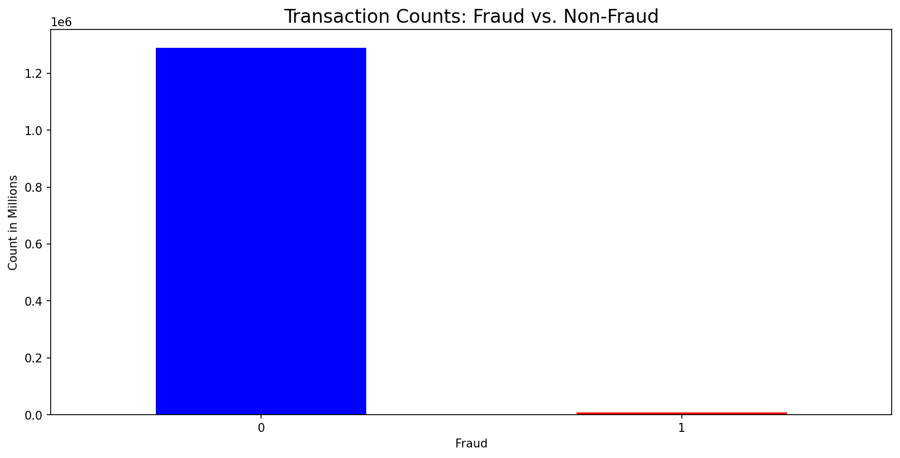

# Model Card: XGBClassifier_tested

## Model Overview
**Developed by:** Leslie Hanson  
**Model Date:** December 2024
**Model Version:** 1.0.2  
**Model Type:** Classification  
**License:** GNU GENERAL PUBLIC LICENSE  
**Model Architecture:** Gradient Boosted Decision Trees

## Intended Use
### Primary Intended Uses
This machine-learning model was developed as part of an academic project to analyze and detect fraudulent credit card transactions. It serves as a proof of concept to demonstrate the application of supervised learning techniques in fraud detection rather than a production-ready solution. The model is intended for educational and exploratory purposes, showcasing feature engineering, model evaluation, and performance analysis in a controlled dataset.

### Out-of-Scope Uses
- **Real-World Fraud Detection:** This model is a proof of concept and is not designed for deployment in a real banking system. It lacks the robustness, security measures, and regulatory compliance needed for production use.
- **Decision-Making on Financial Transactions:** The model should not be used to make actual fraud-related decisions, as it was trained on a limited dataset and may not generalize well to real-world fraud patterns.
- **Legal or Regulatory Compliance:** The model does not meet the standards required for financial fraud detection under industry regulations (e.g., PCI DSS, GDPR, or banking compliance laws).
- **High-Stakes Environments:** The model has not been stress-tested against adversarial attacks or sophisticated fraud techniques used in real financial systems.

## Datasets Used
This project uses the Credit Card Transactions Dataset available on [Kaggle](https://www.kaggle.com/datasets/priyamchoksi/credit-card-transactions-dataset) and [Hugging Face](https://huggingface.co/datasets/pointe77/credit-card-transaction). 
The dataset contains approximately 1.3 million records spanning 18 months and includes 24 columns, covering:   
- **Transaction Information:** Transaction date and time, merchant details, geographical coordinates of both the transaction and of the merchant, population of the city the transaction occurred in, transaction number, and a Unix timestamp of the transaction.
- **Personal Identifiable Information:** Credit card number, first and last name, gender, complete address, job, and date of birth. 
- **Fraud label:** This label allows for a supervised learning model to be used. 

In the `data/get_data.py` script:
- Dataset was programmatically downloaded using the Kaggle API.
- Uploaded to Weights & Biases as an artifact.  
  -  **Artifact:** `credit_card_data`
  -  **Version:** `0`

### Data Preparation  

#### <u>Initial Exploration (`data/data_understanding/Data_Understanding.ipynb`)</u>  
The data was first explored in a Jupyter Notebook using Python, primarily utilizing the **Pandas**, **Matplotlib**, and **Geopandas** libraries. 
The number of fraudulent transactions is 7,506, while the number of non-fraudulent transactions is 1,289,169. The initial analysis included:  
- Verifying overall dataset statistics, such as the number of null values and total transaction records.  
- Examining each column to determine necessary preprocessing steps.  
- Compiling a list of data cleaning and transformation requirements.  

  

<!-- Add more graphs -->

#### <u>Data Cleaning (`clean_data.py`)</u>  
The following modifications were made during the first stage of data preparation:  

- **Column Renaming:**  
  - `'trans_data_trans_time'` → `'trans_dt'` (for brevity).  

- **Column Removal:**  
  - An unnamed index column was dropped for redundancy.  
  - `'first'`, `'last'`, `'gender'` was dropped for bias mitigation.
  - `'unix_time'`, `'street'`, `'zip'`, and `'merch_zipcode'` were dropped as they were redundant; location and datetime processing used latitude, longitude, and transaction datetime instead.  
  - `'city_pop'` was dropped after determining the data was unreliable.  

- **Column Type Optimization:**  
  - `'category'`, `'merchant'`, `'job'`, `'is_fraud'`, `'state'`, and `'city'` were converted to categorical data types to reduce file size and improve processing speed.  

#### Feature Engineering (`feature_creation.py`)  
The following new features were created to enhance model performance:  

- **Time-Based Features:**  
  - Extracted an `hour` column from transaction timestamps.  
  - Created rolling window features to track:  
    - The number of transactions in the last **hour** (`trans_by_last_hr`) and **day** (`trans_by_last_day`) for each account.  
    - The total transaction amount (`amt_by_last_hr`, `amt_by_last_day`) over these time periods.  
  - Created new datetime-related columns: `date`, `year`, `month`, `day`, `week`, and `quarter`.  
  - Dropped `'trans_dt'` after extracting useful datetime components, as the original format was not model-compatible.  

<!-- List and describe the main datasets used for training -->
<!-- Include versions and dates of the datasets -->

### Data Preprocessing and Splitting 

#### Preprocessing (`shared_utils.py`)
- Dropped unnecessary columns: `cc_num`, `job`, `trans_num`, and `date`.
- Removed rows with null values in critical location-based fields (`cust_lat`, `cust_long`, `trans_distance_km`).
- Encoded categorical variables (`merchant` and `category`) using one-hot encoding.

#### Train/Test Split Strategy (`train_all_models.py`)
- Downloaded the final dataset from Weights & Biases (W&B).
- Split customers into fraud and non-fraud groups before splitting them into train (80%) and test (20%) sets.
- Ensured all transactions from the same customer remained in either the training or test set to prevent data leakage.
- Saved the train/test datasets as Parquet files and uploaded them to W&B for versioning and reproducibility.

## Performance Metrics
### Final Test Results
- Precision: 0.97
- Recall: 0.87
- F1-score: 0.918
- Accuracy: 0.998

### Top Feature Importance
1. category_grocery_pos (0.404)
2. category_gas_transport (0.149)
3. amt (0.045)
4. hour (0.043)
5. category_travel (0.026)
6. category_grocery_net (0.020)
7. category_home (0.017)
8. trans_type (0.014)
9. merchant_fraud_Gottlieb, Considine and Schultz (0.012)
10. category_misc_net (0.011)

## Model Parameters
- Learning Rate: 0.3
- Max Depth: 7
- Booster: gbtree
- Device: cuda
- Eval Metric: AUC
- Tree Method: hist

## Limitations and Biases
- Model was trained on artificially generated/anonymized merchant location data
- Potential sampling biases in the public dataset
- May not generalize to real private transaction data
- Cannot process real-time transactions
- Some hardcoded values in pipeline limit reusability
- Relationship between features and outcomes can be difficult to interpret

## Ethical Considerations
- Demographic features (gender, first name, last name) were deliberately excluded to prevent bias
- High precision (0.97) minimizes false positives that could unfairly impact legitimate customers
- Model decisions may need human review for high-stakes situations

## Technical Integration
### Requirements
- Python
- Key Libraries:
  - Pandas
  - Scikit-learn
  - XGBoost
  - NumPy
  - Geopandas
  - GeoPy
  - Matplotlib
  - Seaborn
  - RapidFuzz
  - Weights & Biases (for model tracking)

### Input Data Requirements
- Transaction data must include:
  - Transaction category
  - Amount
  - Time/date information
  - Location data (coordinates preferred)
  - Merchant information
- Missing values should be handled according to the preprocessing pipeline

## Recommendations
1. Test model on small sample of real historical transaction data before full implementation
2. Improve pipeline automation by removing hardcoded values
3. Implement customer verification system for high-risk transactions
4. Set up monitoring for transactions in high-risk categories
5. Establish threshold controls during high-risk hours

## Contact
Author: Leslie Hanson  
Email: lesliemhanson@gmail.com

## Additional Resources
- [Git Repository](https://github.com/LMHan122/Machine_Learning_Analysis_of_Bank_Fraud)
- [Weights & Biases Project](https://wandb.ai/lhan122-student/credit_card_fraud)
- [Interactive Dashboard](https://public.tableau.com/views/Model_dashboard_17341265980230/PublishedDashboard?:language=en-US&:sid=&:redirect=auth&:display_count=n&:origin=viz_share_link)
<!-- Note any potential biases in the data
- Include relevant demographics or distributions -->

<!-- ## Model Architecture
- Model architecture details
- Key hyperparameters
- Number of parameters
- Training infrastructure requirements

## Performance Evaluation
### Metrics
- List primary evaluation metrics used
- Include benchmark results
- Provide context for interpreting the metrics

### Testing Data
- Describe evaluation datasets
- Note any differences from training data
- Include testing methodology

## Limitations and Biases
### Known Limitations
- Technical limitations
- Domain-specific limitations
- Performance boundaries

### Bias and Fairness Assessments
- Results of bias evaluations
- Fairness metrics across different groups
- Identified disparities in performance

## Ethical Considerations
- Potential societal impacts
- Privacy considerations
- Environmental impact
- Recommendations for responsible deployment

## Maintenance
### Updates and Maintenance Plan
- Update frequency
- Monitoring approach
- Feedback collection process

### Version History
- List of previous versions
- Notable changes
- Deprecation schedule (if applicable)

## Additional Information
### Citations
- Related research papers
- Relevant documentation
- Supporting materials

### Contact Information
- Maintenance team contact
- Reporting issues
- Support channels  -->
